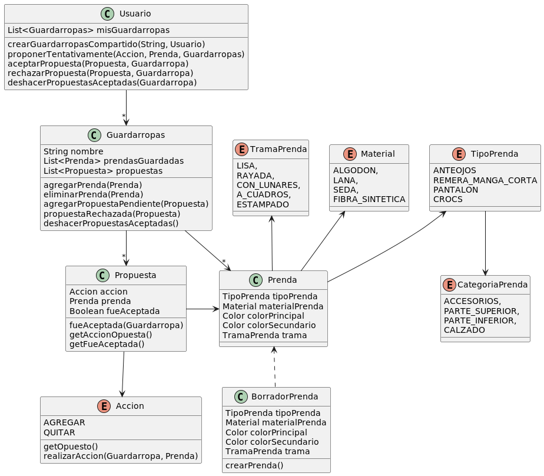

#QUE ME PONGO - EJERCICIO DE CLASE

DIAGRAMA DE CLASES

PSEUDOCODIGO

----------------------------------- QMP5 -------------------------------------------------------------

Class Guardarropas {

    String nombre
    List<Prenda> prendasGuardadas
    List<Propuesta> propuestas

    Guardarropas(String nombre){
        this.nombre = nombre
    }
    
    void agregarPrenda(Prenda prenda){prendasGuardadas.add(prenda)}

    void eliminarPrenda(Prenda prenda){prendasGuardadas.remove(prenda)}

    void agregarPropuestaPendiente(Propuesta propuesta){this.propuestas.add(propuesta)}

    void propuestaRechazada(Propuesta propuesta){this.propuestas.remove(propuesta)}

    void deshacerPropuestasAceptadas(){
        this.propuestasAceptadas()
            .forEach({propuesta -> propuesta.deshacerAccion(this)})
    }

    List<Propuesta> propuestasAceptadas(){return this.propuestas.filter(propuesta ->propuesta.fueAceptada())}
}

Class Usuario {

    List<Guardarropas> misGuardarropas

    void agregarGuardarropas(Guardarropas guardarropa){misGuardarropas.add(guardarropa)}

    void crearGuardarropasCompartido(String nombreGuardarropas, Usuario colaborador){
        Guardarropas guardarropa = new Guardarropas(nombreGuardarropas)
        this.agregarGuardarropas(guardarropa)
        colaborador.agregarGuardarropas(guardarropa)
    }

    void proponerTentativamente(Accion accion,Prenda prenda, Guardarropas guardarropa){
        Propuesta propuesta = new Propuesta(accion, prenda)
        guardarropa.agregarPropuesta(propuesta)
    }

    void aceptarPropuesta(Propuesta propuesta, Guardarropa guardarropa){
        propuesta.fueAceptada(guardarropa)
    }
    
    void rechazarPropuesta(Propuesta propuesta, Guardarropa guardarropa){
        guardarropa.propuestaRechazada(propuesta)
    }

    void deshacerPropuestasAceptadas(Guardarropa guardarropa){guardarropa.deshacerPropuestasAceptadas()}

}

enum Accion{

    abstract Accion getOpuesto();
    abstract void realizarAccion(Guardarropa guardarropa, Prenda prenda);
    
    AGREGAR {
        @override
        Accion getOpuesto() {return QUITAR}
    
        @override
        void realizarAccion(Guardarropa guardarropa, Prenda prenda) {guardarropa.agregarPrenda(prenda)}
    },
    QUITAR{
        @override
        Accion getOpuesto() {return AGREGAR}

        @override
        void realizarAccion(Guardarropa guardarropa, Prenda prenda) {guardarropa.eliminarPrenda(prenda)}
    }
}

Class Propuesta{

    Accion accion
    Prenda prenda
    Boolean fueAceptada = false

    Propuesta(Accion accion,Prenda prenda){
        this.accion = accion
        this.prenda = prenda
    }

    void fueAceptada(Guardarropa guardarropa){
        this.fueAceptada = true
        this.accion.realizarAccion(guardarropa,this.prenda)
    }

    Accion getAccionOpuesta(){return this.accion.getOpuesto()}

    Boolean getFueAceptada() {return this.fueAceptada}

    void deshacerAccion(Guardarropa guardarropa){
        this.getAccionOpuesta().realizarAccion(guardarropa,this.prenda)
    }

}

----------------------------------- QMP2 -------------------------------------------------------------

Class BorradorPrenda{

    TipoPrenda tipoPrenda
    Material materialPrenda
    Color colorPrincipal
    Color colorSecundario
    TramaPrenda trama = TramaPrenda.LISA
    
    void setTipo(TipoPrenda tipo){
        this.tipoPrenda = tipo;
    }

    void setMaterial(Material materialPrenda){
        this.materialPrenda = materialPrenda;
    }
    
    void setColorPrincipal(Color colorPrimario){
        this.colorPrincipal = colorPrimario;
    }

    void setColorSecundario(Color color){
        this.colorSecundario = color;
    }    

    void setTrama(TramaPrenda trama){
        this.trama = trama;
    }

    void validarPrenda(){
        requireNonNull(tipoPrenda,"Falta el tipo de prenda");
        requireNonNull(materialPrenda,"Falta el material de prenda");
        requireNonNull(colorPrincipal,"Falta el color principal de prenda");
    }

    Prenda crearPrenda(){
        validarPrenda();
        return new Prenda(tipoPrenda,materialPrenda,colorPrincipal,colorSecundario,trama);
    }

}

----------------------------------- QMP1 -------------------------------------------------------------

enum CategoriaPrenda{

    ACCESORIOS,
    PARTE_SUPERIOR,
    PARTE_INFERIOR,
    CALZADO
}

enum Material{

    ALGODON,
    LANA,
    SEDA,
    FIBRA_SINTETICA
}

enum TipoPrenda{

    abstract CategoriaPrenda getCategoria()

    ANTEOJOS{@override getCategoria(){return ACCESORIOS}},
    REMERA_MANGA_CORTA{@override getCategoria(){return PARTE_SUPERIOR}},
    PANTALON{@override getCategoria(){return PARTE_INFERIOR}},
    CROCS{@override getCategoria(){return CALZADO}}
}

enum TramaPrenda{

    LISA,
    RAYADA,
    CON_LUNARES,
    A_CUADROS,
    ESTAMPADO
}

Class Prenda{

    TipoPrenda tipoPrenda
    Material materialPrenda
    Color colorPrincipal
    Color colorSecundario
    TramaPrenda trama = TramaPrenda.LISA

    Prenda(TipoPrenda tipo, Material material, Color colorPrimario, Color colorSecundario, TramaPrenda trama){
        this.tipoPrenda = tipo;
        this.materialPrenda = material;
        this.colorPrincipal = colorPrimario;
        this.colorSecundario = colorSecundario;
        if(trama != null){
            this.trama = trama;
        }
    }

    void setColorSecundario(Color color){
        this.colorSecundario = color;
    }

    CategoriaPrenda getCategoria{
        return tipo.getCategoria()
    }    
}
