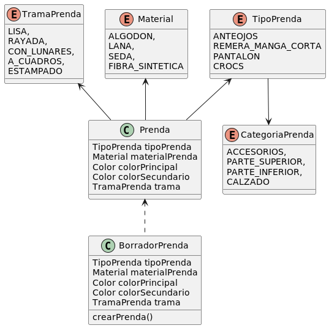

#QUE ME PONGO - SEGUNDA ITERACIÓN

DIAGRAMA DE CLASES

PSEUDOCODIGO

enum CategoriaPrenda{

    ACCESORIOS,
    PARTE_SUPERIOR,
    PARTE_INFERIOR,
    CALZADO
}

enum Material{
    ALGODON,
    LANA,
    SEDA,
    FIBRA_SINTETICA
}

enum TipoPrenda{

    abstract CategoriaPrenda getCategoria()

    ANTEOJOS{@override getCategoria(){return ACCESORIOS}},
    REMERA_MANGA_CORTA{@override getCategoria(){return PARTE_SUPERIOR}},
    PANTALON{@override getCategoria(){return PARTE_INFERIOR}},
    CROCS{@override getCategoria(){return CALZADO}}
}

enum TramaPrenda{
    LISA,
    RAYADA,
    CON_LUNARES,
    A_CUADROS,
    ESTAMPADO
}

Class Prenda{

    TipoPrenda tipoPrenda
    Material materialPrenda
    Color colorPrincipal
    Color colorSecundario
    TramaPrenda trama = TramaPrenda.LISA

    Prenda(TipoPrenda tipo, Material material, Color colorPrimario, Color colorSecundario, TramaPrenda trama){
        this.tipoPrenda = tipo;
        this.materialPrenda = material;
        this.colorPrincipal = colorPrimario;
        this.colorSecundario = colorSecundario;
        if(trama != null){
            this.trama = trama;
        }
    }

    void setColorSecundario(Color color){
        this.colorSecundario = color;
    }

    CategoriaPrenda getCategoria{
        return tipo.getCategoria()
    }    
}

Class BorradorPrenda{

    TipoPrenda tipoPrenda
    Material materialPrenda
    Color colorPrincipal
    Color colorSecundario
    TramaPrenda trama = TramaPrenda.LISA
    
    void setTipo(TipoPrenda tipo){
        this.tipoPrenda = tipo;
    }

    void setMaterial(Material materialPrenda){
        this.materialPrenda = materialPrenda;
    }
    
    void setColorPrincipal(Color colorPrimario){
        this.colorPrincipal = colorPrimario;
    }

    void setColorSecundario(Color color){
        this.colorSecundario = color;
    }    

    void setTrama(TramaPrenda trama){
        this.trama = trama;
    }

    void validarPrenda(){
        requireNonNull(tipoPrenda,"Falta el tipo de prenda");
        requireNonNull(materialPrenda,"Falta el material de prenda");
        requireNonNull(colorPrincipal,"Falta el color principal de prenda");
    }

    Prenda crearPrenda(){
        validarPrenda();
        return new Prenda(tipoPrenda,materialPrenda,colorPrincipal,colorSecundario,trama);
    }
    
}
